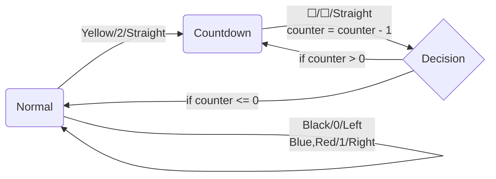

[Source Code](https://github.com/ben-my-to/CPSC-335/tree/main/Project%201)

## Online Demo[^1]

$q_t$ = <output id="qt"></output> 
$T_{ij}$ = <output id="tij"></output> 
$\theta$ = <output id="theta"></output> 
$\text{counter}$ = <output id="counter"></output>

<figure>
    <canvas width="800" height="400" id="game"></canvas> 
    <figurecaption>Fig. 1: Larks Ant Demo</figurecaption>
</figure>

<!--  -->

[^1]: Figure 1 provides an online demonstration of the computations performed by the Larks Ant starting from $i,j=(400,200)$ on $T\in\mathbb{Z}^{800\times 400}$. Press the `[h]` to stop/run the demo. Press `[a/d]` to increase/decrease the speed by a factor of 10. Note that since $T$ is finite, the Larks Ant will wrap around when necessary to prevent overflow. The script is a modified version from [CS231n-demos](http://vision.stanford.edu/teaching/cs231n-demos/linear-classify/).

## Introduction

__Definition 1__: Larks Ant is a 2D cellular automaton $\mathcal{A}$ that consists of a set of states $\mathbf{Q}$, a quadruple of colors $\Sigma$, an initial state $q_t\in\mathbf{Q}$, a local variable $\text{counter}$, and a transition function $\delta_\mathcal{A}:\mathbf{Q}\times\Sigma\to\mathbf{Q}\times\Sigma\times\theta$ where

$$\mathbf{Q}\in\lbrace\text{Normal, Countdown}\rbrace.$$
$$\Sigma\in(\text{Black, Blue, Yellow, Red}).$$
$$-\frac{\pi}{2}\le\theta\le\frac{\pi}{2}.$$

Let $T=\mathbb{Z}^2$ represent a two-dimensional grid. Initially at time $t=0$, $\mathcal{A}(0)$ has an initial state $q_0=\text{Normal}$, is located at color cell $T_{ij}$ for some initial $i,j\in\mathbb{Z}$ and is oriented at $\mathbf{v}=\begin{bmatrix}0 & 1\end{bmatrix}$, the north direction. Then, at every time step $t>0$, the cellular automaton $\mathcal{A}(t)$ computes as follows:

  1. Sets $(q_t,c,\theta) \leftarrow \delta_\mathcal{A}(q_{t-1},T_{ij})$ and $\text{counter}\leftarrow c$.
  2. Changes orientation $\mathbf{v}\leftarrow R\mathbf{v}=\begin{bmatrix}\cos\theta & -\sin\theta \\\ \sin\theta & \cos\theta\end{bmatrix}\begin{bmatrix}v_0 \\\ v_1\end{bmatrix}$.

  3. Increments the cell color $c\leftarrow(c+1)\bmod|\Sigma|$.
  4. Moves to coordinate $\begin{bmatrix}i&j\end{bmatrix}\leftarrow\begin{bmatrix}i&j\end{bmatrix}+\alpha\mathbf{v}$.

where $\alpha\in\mathbb{N}_+$ is the grid scale.

---

Let $\text{Left}=\frac{\pi}{2},\ \text{Right}=-\frac{\pi}{2},\ \text{and}\ \text{Straight}=0$ and assume _without loss of generality_, every cell color $T_{ij}=\text{Black}$. Then, the function $\delta_\mathcal{A}$ can be represented as

## Examples

__Example 1__: We now provide a worked example for the first iteration computed by the Larks Ant. Let $\alpha=10$ and $i,j=(400,200)$. Then at time step $t=1$, $\mathcal{A}(1)$ computes as follows:

1. Sets ($\text{Normal}$, $0$, $\text{Left})\leftarrow\delta_{\mathcal{A}}(\text{Normal},\text{Black})$ and $\text{counter}\leftarrow 0$.
2. Changes orientation:
$$
\mathbf{v}\leftarrow\begin{bmatrix}\cos\left(\frac{\pi}{2}\right) & -\sin\left(\frac{\pi}{2}\right) \\\ \sin\left(\frac{\pi}{2}\right) & \cos\left(\frac{\pi}{2}\right)\end{bmatrix}\begin{bmatrix}0 \\\ 1\end{bmatrix}=\begin{bmatrix}0 & -1 \\\ 1 & 0\end{bmatrix}\begin{bmatrix}0 \\\ 1\end{bmatrix}=\begin{bmatrix}(0)\cdot(0)+(-1)\cdot(1) \\\ (1)\cdot(0)+(0)\cdot(1)\end{bmatrix}=\begin{bmatrix}-1 \\\ 0\end{bmatrix}.
$$

3. Increments the cell color $c\leftarrow((0)+1)\bmod (4)=1$.
4. Moves to coordinate $\begin{bmatrix}i&j\end{bmatrix}\leftarrow\begin{bmatrix}i&j\end{bmatrix}+\alpha\mathbf{v}=\begin{bmatrix}400&200\end{bmatrix}+(10)\cdot\begin{bmatrix}-1&0\end{bmatrix}=\begin{bmatrix}390&200\end{bmatrix}$.

