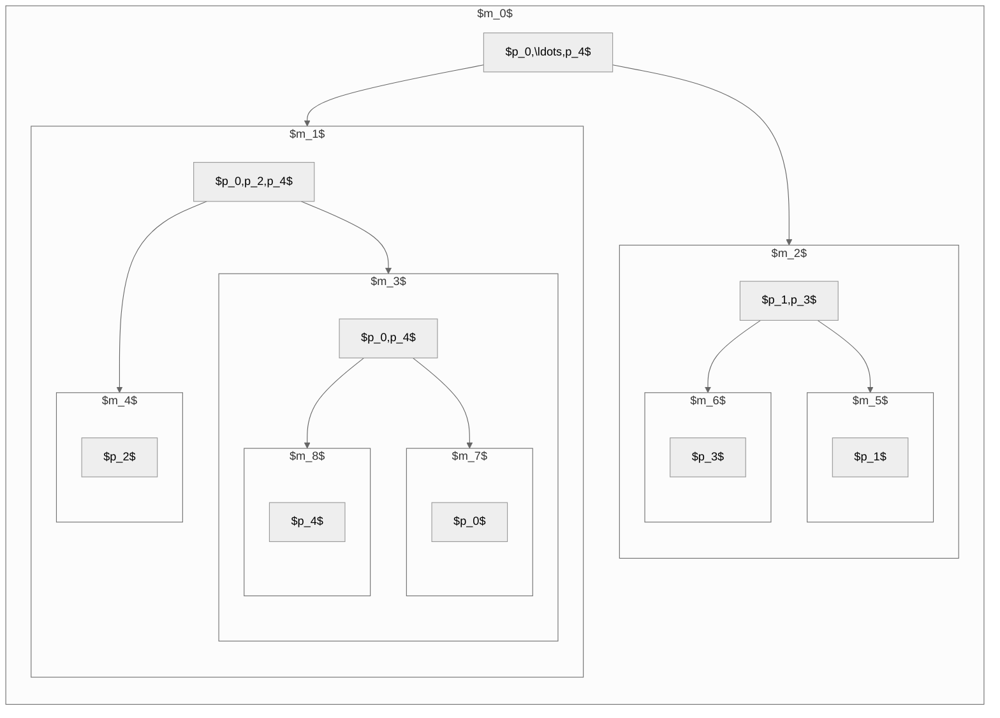

[Link to Source Code](https://github.com/ben-my-to/mpitree)

## Try it Out![^1]

<iframe width="803.5" height="445.5" src="https://editor.p5js.org/ben-my-to/full/BhAJPmrSD"></iframe>

[^1]: An online visualization of the decision boundaries decided by a Decision Tree Classifier. Feel free to drag individual data points and sliders to explore how the decision boundary and accuracy of the model changes. This script is a modified version from [CS231n-demos](http://vision.stanford.edu/teaching/cs231n-demos/knn/).

## Introduction

A __Decision Tree__ is an $n$-nary tree where each node represents a feature _(interior nodes)_ or response _(terminal/leaf nodes)_ value, and each branch represents a condition on some feature. Decision Trees are intuitive _supervised_ machine learning algorithms for classification and regression problems. Decision Trees behave by posing questions about the data to narrow their choices until they are somewhat confident in their predictions. The fundamental procedure for a decision tree involves recursively querying each feature and partitioning the dataset and feature space into disjoint subsets and regions until there is no ambiguity about the response variable. The primary goal of any machine learning model is _generalization_ -- the model's ability to perform well on future, unseen data. Therefore, the general approach to learning an optimal decision tree involves asking "good" questions _(the features that maximize the information gain[^2])_ about the data that leads to the most certainty about the response variable each time.

[^2]: Information gain quantifies the increase in confidence about a response variable after querying a feature. A higher value _(bits)_ for information gain implies a greater likelihood of achieving purer splits _(no uncertainty on a prediction)_.

A __Decision Tree Classifier__ is a decision tree whose prediction of a response variable is from a set of finite classes. Given some observed data, examples of classification-type problems are whether an incoming patient has cancer, whether an email is spam or not spam, or whether a fruit is an apple, banana, or orange _(multi-classification)_.

## Methodology

Most well-known algorithms _(such as the ID3 or CART)_ for learning a decision tree require a _greedy_ search across all features. Unfortunately, the problem of finding the best sequence of splitting rules is __NP-Complete__. We propose a __Parallel Decision Tree__, a distributed decision tree algorithm using MPI _(Message Passing Interface)_.

The Parallel Decision Tree algorithm aims to reduce the time taken by a _greedy_  search across all features through [_data parallelism_](https://en.wikipedia.org/wiki/Data_parallelism). It schedules processors to a number of sub-communicators in a _cyclic distribution_[^3], roughly evenly across levels of a split feature. Processors in each sub-communicator concurrently participate in calculating the split feature and await completion at their parent communicator for all other processors in that communicator. Let $k$ be the total number of processors in some communicator and $n$ be the number of levels, where $k,n\in\mathbb{N}$ such that $k\ge n\ge 2$. Then, a sub-communicator $m$ contains at most $\lceil k/n \rceil$ processors, and at least $[1\ldots n)$ processors. Each process's identifier $p_{i\in[k]}$ is then assigned to the sub-communicator $m = i\bmod n$ and receives a unique identifier in that group $p_i = \lfloor i/n \rfloor$.

[^3]: Figure 1 demonstrates the partitioning from communicator $m_0$ where the number of levels $n=2$ and number of processors $k=5$. Processors $p_0,p_2,p_4$ are scheduled to sub-communicator $m_1$ as each processor's identifier is even _(divisible by 2)_, processors $p_1,p_3$ are scheduled to sub-communicator $m_2$ as each processor's identifier is odd, etc.

<figcaption>Fig. 1: Cyclic Distribution</figcaption>

### Mathematical Modelling

__Definition 1__: A _cyclic distribution_ function $f_m:\left[k\right]\to\mathcal{M}$ takes as input a $k$-tuple of processors and outputs a set of communicators $\mathcal{M}$ is defined as

$$
f_m(p_0,\ldots, p_{k-1}) = \lbrace m \rbrace\cup
\begin{cases}
    \emptyset & k=1 \\\
    \bigcup_{j\in\left[n\right]}f_{mn+j+1}(p_i\mapsto\lfloor i/n \rfloor : i\bmod n=j) & \text{otherwise}.
\end{cases}
$$

for some natural numbers $k\ge n\ge 2$ and $m$.

## Model Evaluation and Analysis

### Decision Boundaries varying values for the `max_depth` hyperparameter

As a decision tree grows deeper, overfitting becomes evident because predictions rely on increasingly smaller regions of the feature space. In a way, the decision tree model tends to bias toward _singleton nodes_, potentially resulting in mispredictions in the presence of noisy data[^4].

[^4]: Figure 2 illustrates decision boundaries for different values of the `max_depth` hyperparameter on the iris dataset provided by _scikit-learn_. The figure showcases how noisy instances may negatively impact the performance of the decision tree classifier as the depth increases.

Pre-and-post-pruning techniques are some solutions to reduce the likelihood of an overfitted decision tree. Pre-pruning techniques introduce early stopping criteria (e.g., `max_depth`, `min_samples_split` hyperparameters). In conjunction, validation methodologies such as $k$-fold Cross-Validation can be applied select optimal values for such hyperparameters.

<figure class="image">

  <figcaption>Fig. 2: Decision Boundaries on the Iris Dataset</figcaption>
</figure>

### Parallel Execution Times

Figure 3 below shows a plot of the number of training samples versus the time taken _(ms)_ to train four decision tree classifiers _(one sequential and three in-parallel)_. All decision tree classifiers were trained with the same examples, sampled over a uniform distribution, across all iterations. Our experiment yields an average speedup of $\bar{S}=1.7$.

<figure class="image">

  <figcaption>Fig. 3: Parallel Execution Times</figcaption>
</figure>

### Message Complexity

__Theorem 1__: The _Parallel Decision Tree_ classifier $\mathcal{T}$ exchanges at most $O(k^2)$ messages.

Proof.

__Definition 1__ constructs a full $n$-nary communicator tree $\mathcal{M}$  _(each node has 0 or $n$ children)_ of height $h=\lceil\log_n k\rceil + 1$. Assume $\mathcal{T}\supseteq\mathcal{M}$. Then, for each $m\in\mathcal{M}$ subject to $|m|\ge 2$, processors must exchange $k=|m|$ messages for a total of $k^2$ messages through the `MPI.allgather` function. As such, each process obtains a sub-tree computed by every other process.

<figure class="image">

  <figcaption>Fig. 4: Communication Costs for Binary Trees</figcaption>
</figure>

__Remark__: We will use _integer division_ throughout the proof.

Let $0\le c\le h-2$ be a split performed by `MPI.Split`. At split $c=0$, processors exchange $k^2$ messages. At the successor split $c=1$, processors exchange $n\cdot(k/n)^2$ messages. At split $c=3$, processors exchange $n^2\cdot(k/n^2)^2$ and so on and so forth[^5]. Therefore, we can define the recurrence relation $\mathbf{M}(k)$, the total number of exchanged messages by $k$ processors, as

[^5]: Figure 4 shows the number of messages exchanged at each level of a perfect _(although not necessary)_ binary tree. Each successive split reduces the number of processors by two until all remaining nodes are singletons.

$$
\mathbf{M}(k)=
\begin{cases}
  0 & k=1\\\
  n^c\cdot k^2+\mathbf{M}(k/n) & \text{otherwise}.
\end{cases}
$$

Solving the recurrence relation using the _iteration_ method, we obtain the closed formula

$$
\begin{align}
\mathbf{M}(k) &= n^{(0)} \cdot k^2 + \mathcal{M}(k/n)\\\
               &= (1)\cdot k^2 + \left[n^{(1)} \cdot (k/n)^2 + \mathcal{M}(k/n^2)\right]\\\
               &= {\color{red}k^2} + nk^2/n^2 + \left[n^{(2)} \cdot (k/n^2)^2 + \mathcal{M}(k/n^3)\right]\\\
               &= k^2 + {\color{red}k^2/n} + n^2 k^2/n^4 + \mathcal{M}(k/n^3) + \dots + \mathcal{M}(k/n^{h-2})\\\
               &= k^2 + k^2/n + {\color{red}k^2/n^2} + n^3 k^2/n^6 + \dots + \left[n^{\lceil\log_n k\rceil-1}\cdot (k/n^{\lceil\log_n k\rceil-1})^2 + \mathcal{M}(k/n^{\lceil\log_n k\rceil})\right]\\\
               &= k^2 + k^2/n + k^2/n^2 + {\color{red}k^2/n^3} + \dots + (k/n)\cdot k^2/n^{2(\lceil\log_n k\rceil)-2} + \mathcal{M}(1)\\\
               &= k^2 + k^2/n + k^2/n^2 + k^2/n^3 + \dots + (k/n)\cdot k^2n^2/k^2+0\\\
               &= k^2 + k^2/n + k^2/n^2 + k^2/n^3 + \dots + {\color{red}kn}.
\end{align}
$$

Noting that $n^c\cdot(k/n^c)^2 = k^2n^{-c}$, the worst-case message complexity of $\mathcal{T}$ is

$$
O\left(\mathbf{M}(k)\right)=O\left(\sum_{c=0}^{h-2} k^2n^{-c}\right) = O\left(k^2+k^2n^{-1}+k^2 n^{-2}+\dots+kn\right) = O(k^2).
$$

$\blacksquare$

## Future Works

Our implementation is restricted to binary trees ($n=2$) with numerical data. We plan to extend the functionality to handle categorical, sparse, missing, etc. data and regression problems in the next iteration.
